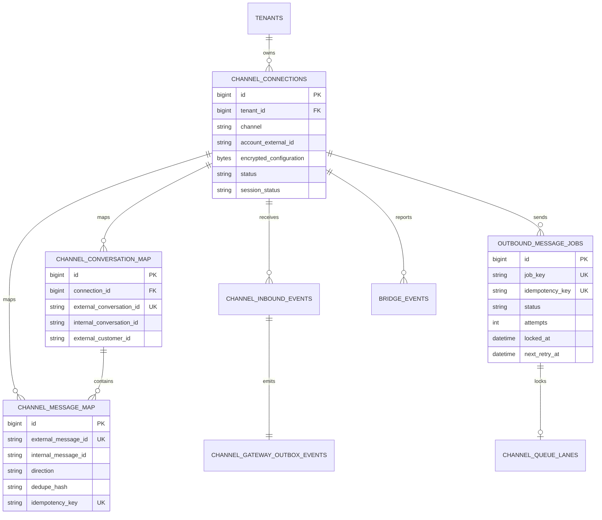
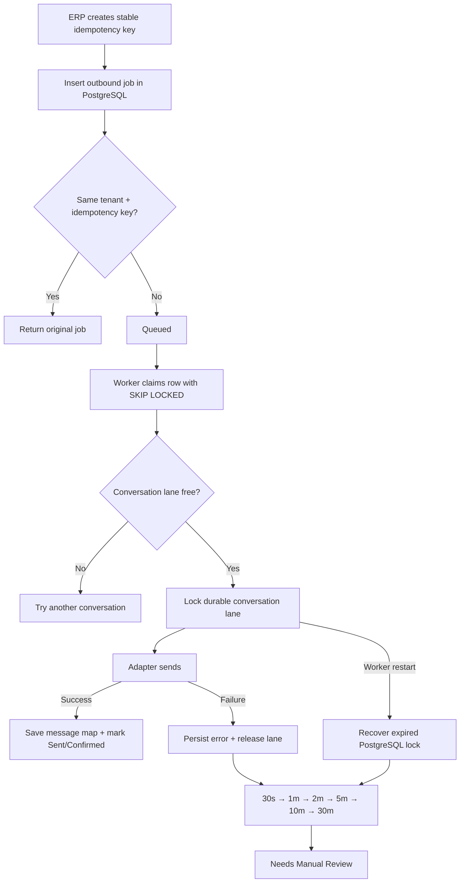

# تقرير تأسيس M1 Channel Gateway

التاريخ: 2026-07-18  
الحالة: **Foundation implemented and tested — disabled by default**  
النشر/الرفع/التشغيل على الإنتاج: **لم يتم**

## النتيجة

تم إنشاء خدمة مستقلة باسم `m1-channel-gateway`. لا يوجد داخلها Browser Bridge حاليًا، ولم يتغير مسار WhatsApp أو Messenger أو Instagram القائم. الخدمة لن ترسل رسالة ما لم تتم إضافة Adapter في مرحلة لاحقة وتفعيل العامل صراحة.

PostgreSQL هو مصدر الحقيقة للرسائل والأحداث والطابور والـmapping. Redis مخصّص فقط للأقفال القصيرة، rate limiting، temporary dedupe، coordination، presence وtyping. سقوط Redis لا يفقد Job أو رسالة مقبولة.

## الملفات الرئيسية

- `services/m1-channel-gateway/src/contracts/channelEnvelope.js`: العقد الموحّد والـnormalization والـfallback dedupe.
- `services/m1-channel-gateway/src/adapters/ChannelAdapter.js`: واجهة كل Channel Adapter.
- `services/m1-channel-gateway/src/queue/PostgresOutboundQueue.js`: الطابور الدائم وقفل كل محادثة والاسترجاع.
- `services/m1-channel-gateway/src/messages/InboundMessageStore.js`: قبول inbound مع الـmaps والـoutbox داخل transaction واحدة.
- `services/m1-channel-gateway/src/outbox/TransactionalOutboxPublisher.js`: نشر أحداث الـERP بعد نجاح الـcommit.
- `services/m1-channel-gateway/src/redis/RedisCoordinator.js`: استخدامات Redis غير الدائمة.
- `services/m1-channel-gateway/src/security/*`: تشفير إعدادات الاتصال وHMAC + replay protection.
- `services/m1-channel-gateway/src/observability/*`: structured logging وhealth snapshot وbridge events.
- `services/m1-channel-gateway/src/media/MediaProcessor.js`: تطبيع الميديا وحدود الحجم والبروتوكول.
- `services/m1-channel-gateway/migrations/001_channel_gateway_foundation.sql`: Migration الأساس.
- `services/m1-channel-gateway/tests/*`: اختبارات العقود، الأمان، PostgreSQL، recovery، dedupe وoutbox.

كذلك تم استبدال بحث الإرسال الذي كان قد يصل إلى 1000 محادثة في `server/routes/aiAgentOrders.js` وhelpers المرتبطة به ببحث exact indexed عن Conversation ID.

## الجداول الجديدة

- `channel_connections`
- `channel_conversation_map`
- `channel_message_map`
- `channel_inbound_events`
- `outbound_message_jobs`
- `channel_queue_lanes`
- `bridge_events`
- `channel_gateway_outbox_events`
- `channel_gateway_request_nonces`
- `channel_gateway_schema_migrations`

لم يُحذف أو يُعاد تسمية أي جدول قائم.

## ER Diagram



## Queue Flow



## Transaction وحدود WebSocket

لا يمكن جعل WebSocket broadcast جزءًا ذريًا من Database Transaction. الحل المستخدم هو Transactional Outbox:

```text
Inbound event + Conversation Map + Message Map + Outbox Event
                         داخل COMMIT واحد
                                  ↓
                   Publisher يسلّم الحدث بعد الـcommit
```

لم تتغير الأحداث الحالية `ai_inbox:message` و`ai_inbox:refresh`. لم تتم إضافة event جديدة ولم يتغير Web أو PWA في هذه المرحلة. ناشر الـOutbox موجود لكنه غير موصول بالـERP حتى مرحلة التكامل التالية، لذلك لا يوجد مسار مزدوج أو duplicate حاليًا.

## Redis Usage

Redis لا يحتوي message bodies أو durable jobs. الاستخدامات المنفذة:

- Distributed ephemeral locks مع token-safe release.
- Temporary dedupe hints.
- Rate limiting.
- Presence/typing/realtime ephemeral state.
- Health latency.

عند عدم وجود Redis تظهر الحالة `disabled/degraded` وتظل PostgreSQL queue سليمة.

## PostgreSQL Usage

- Durable inbound event ledger.
- Durable outbound queue and retry state.
- Conversation lanes.
- External/internal conversation and message maps.
- Idempotency and dedupe unique constraints.
- Encrypted channel configuration fields.
- Transactional outbox.
- HMAC replay nonces.
- Migration history and checksums.

## Health and logging

Health Snapshot يعرض PostgreSQL، Redis، queue counts، pending/failed، worker state، registered adapters، memory، CPU، last incoming، last outgoing، last sync وحالات الاتصالات. مراقب adapters يعمل كل دقيقة، لكن عدد adapters حاليًا صفر.

السجلات JSON ويتم حجب cookies/tokens/passwords/secrets/config ciphertext تلقائيًا.

## نتائج الاختبارات

- Channel Gateway: **15/15 passed** باستخدام PostgreSQL محلي في schema مؤقتة تمت إزالتها بعد الاختبار.
- AI Inbox/PWA/message compatibility: **43/43 passed**.
- AI Inbox sales flow script: **9/9 passed**.
- Production Vite build: **passed**.
- JavaScript syntax checks للخدمة والملفين المعدلين في ERP: **passed**.
- Full repository suite: **282 passed / 294 total / 5 skipped / 7 failed**. حالات الفشل السبعة موجودة في POS service-worker، product pricing، purchase quantity، وStorefront footer/hero؛ لا تمس ملفات Gateway أو AI Inbox، وبعضها يتقاطع مع تعديلات مشتريات موجودة مسبقًا في working tree ولم يتم تعديلها ضمن هذه المهمة.

الاختبارات تشمل idempotent enqueue، conversation serialization، parallel conversations، restart recovery، inbound dedupe، transactional outbox، encryption، HMAC، log redaction وmedia safety.

## المخاطر والـgates قبل التفعيل

1. لا يوجد Adapter فعلي حتى الآن، وهذا مقصود حسب المرحلة.
2. Outbox consumer داخل ERP لم يُفعّل؛ يجب إضافته واختباره مع الأحداث الحالية قبل أي Bridge.
3. الـworker مغلق افتراضيًا، ولا يجب فتحه قبل اكتمال Integration Test مع provider sandbox.
4. المشروع القديم ما زال يحتوي legacy runtime schema guards في عدة services. لم يتم حذفها بصورة واسعة في هذه المرحلة لأن ذلك يحتاج Migration منفصلة واختبار upgrade على نسخة من Production؛ Gateway نفسه لا يعدّل schema عند startup.
5. Docker غير متاح على جهاز التطوير؛ تم اختبار PostgreSQL مباشرة داخل schema مؤقتة، ولم يتم اختبار image build محليًا.
6. PWA offline outbound queue الحالية ليست جزءًا من Gateway foundation بعد؛ بقيت بلا تغيير حتى لا ينكسر السلوك الحالي.
7. مجموعة الاختبارات الكاملة ليست خضراء مسبقًا: توجد 7 اختبارات غير مرتبطة مذكورة أعلاه. لذلك Gate المرحلة التالية يعتمد على بقاء اختبارات Gateway وAI Inbox خضراء، مع معالجة تلك الأعطال في task منفصلة دون خلطها بتأسيس القنوات.

## Rollback Plan

الـrollback التشغيلي الآمن:

1. إبقاء `CHANNEL_GATEWAY_WORKER_ENABLED=false`.
2. إيقاف خدمة Gateway فقط.
3. استمرار ERP والقنوات الحالية دون تغيير لأنها لم تُحوّل إلى Gateway.
4. الاحتفاظ بالجداول الجديدة وعدم حذفها حتى لا تفقد accepted events أو jobs.
5. التراجع عن exact lookup في ERP فقط إذا ظهر regression، مع بقاء الفهارس والجداول بلا ضرر.

يوجد Down Migration للتطوير/بيئة فارغة فقط. لا يُستخدم في Production بعد استقبال بيانات.

## القرار المطلوب للمرحلة التالية

بعد مراجعة هذا التقرير، المرحلة التالية ليست Browser Bridge مباشرة. الأولوية هي ERP Outbox Consumer + Shadow Ingestion خلف feature flag، ثم اختبار Web/PWA realtime parity. بعد نجاحها يمكن بناء أول Adapter دون تغيير AI Inbox.
