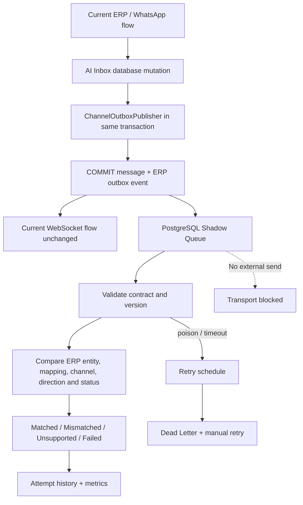

# تقرير Phase 2 — ERP Outbox + Shadow Mode

التاريخ: 2026-07-18  
الحالة: **تم التنفيذ والاختبار محليًا — غير مفعّل افتراضيًا**  
Commit / Push / Deploy / Browser Bridge: **لم يتم**

## النتيجة

تم ربط نقاط حفظ رسائل AI Inbox الفعلية بطبقة `ChannelOutboxPublisher` خلف Feature Flags مغلقة افتراضيًا. عند تفعيل Shadow Mode في بيئة اختبار، يتم حفظ الرسالة وOutbox Event داخل نفس PostgreSQL transaction. يقرأ Gateway الحدث ويعمل Validate + Normalize + Compare + Log فقط.

لا يستطيع Shadow Consumer:

- إرسال رسالة إلى WhatsApp أو Meta أو أي provider.
- إنشاء رسالة داخل AI Inbox.
- تعديل delivery status أو Human Takeover أو Assignment أو Draft.
- بث WebSocket event.
- تخزين Shadow event داخل Service Worker أو PWA cache.

## Architecture



## المسؤوليات

### ERP Producer

`server/services/channelOutboxPublisher.js` يبني ويتحقق من العقد ويكتب الحدث. لا توجد SQL مبعثرة داخل controllers.

رسائل inbound/outbound وتغيير delivery status تُربط بالـOutbox داخل transaction واحدة في `aiSupportLogService.js`. تغييرات conversation/human takeover/assignment تستخدم نفس المبدأ عند تفعيل Shadow Mode.

### Gateway Consumer

`PostgresShadowEventQueue` يقرأ بـ`FOR UPDATE SKIP LOCKED`، يسجل attempts، يسترجع الأقفال المنتهية بعد restart، ويمنع إعادة معالجة event مكتمل. `ShadowComparator` يقرأ الحالة الحالية فقط ولا يغيّرها.

PostgreSQL هو Source of Truth. Shadow Consumer لا يعتمد على Redis لمعرفة status أو retry أو dead letter.

## Migration الجديدة

`002_erp_shadow_outbox.sql` أضافت:

- `erp_channel_outbox_events`
- `channel_shadow_comparison_results`
- `channel_outbox_attempt_history`

الفهارس تغطي `status`, `next_attempt_at`, `aggregate_id`, `event_type`, `created_at`, و`locked_at`.

لم يتم تطبيق Migration على قاعدة الإنتاج.

## Event Contract

الأحداث المدعومة:

- `conversation.created`
- `conversation.updated`
- `message.created`
- `message.outbound_requested`
- `message.status_changed`
- `human_takeover.changed`
- `assignment.changed`

كل حدث يحتوي `event_id`, `event_type`, `event_version`, `tenant_id`, `aggregate_type`, `aggregate_id`, `occurred_at`, `payload`, `correlation_id`, `causation_id`, و`source`.

`event_id` ثابت للأحداث المرتبطة بنفس الرسالة والحالة، والجدول يملك Unique Constraint. لذلك retry أو استدعاء transcript المكرر لا ينشئ event مكررًا.

## Transaction Boundaries

```text
BEGIN
  upsert conversation/session
  insert or update AI Inbox message
  insert deterministic ERP outbox event(s)
COMMIT
```

إذا فشل Outbox insert يتم `ROLLBACK`. اختبار دوال AI Inbox الحقيقية عطّل جدول Outbox مؤقتًا وأثبت أن الرسالة لم تُحفظ.

لا توجد network call داخل transaction. إرسال WhatsApp الحالي ظل كما هو؛ الـOutbox يراقب transcript الناتج فقط.

## Feature Flags

```text
CHANNEL_GATEWAY_ENABLED=false
CHANNEL_GATEWAY_SHADOW_MODE=true
CHANNEL_GATEWAY_OUTBOUND_ENABLED=false
CHANNEL_GATEWAY_INBOUND_ENABLED=false
CHANNEL_GATEWAY_COMPARE_ENABLED=true
CHANNEL_GATEWAY_WORKER_ENABLED=false
```

القيم الافتراضية تمنع التشغيل. وحتى عند تشغيل API في Shadow Mode، endpoints الخاصة بـinbound/outbound transport ترجع رفضًا ولا تنشئ job للإرسال.

## Shadow Comparison

المقارنة تتحقق من:

- Tenant وMessage/Conversation ID.
- Channel وDirection وMessage Type وStatus.
- Idempotency key.
- وجود Channel Connection.
- وجود Conversation Mapping.
- Conversation status وAI enabled وAssignment.
- Event type/version/schema.

النتيجة تُحفظ مرة واحدة لكل `event_id` مع expected/actual/difference وprocessing latency.

## WhatsApp Shadow Results

لم يتم إرسال WhatsApp فعلي ولم يتغير Evolution API. تم اختبار المسار الحقيقي لحفظ transcript محليًا:

- Inbound WhatsApp أنشأ `message.created` مرة واحدة.
- Outbound WhatsApp أنشأ `message.outbound_requested`, `message.created`, و`message.status_changed`.
- فشل Outbox ألغى حفظ الرسالة.
- اختبارات WhatsApp الحالية ظلت ناجحة.
- Comparator سجّل `matched` عند وجود connection/mapping الصحيحين.
- Missing mapping أو entity يظهر `mismatched` بدل إصلاح البيانات تلقائيًا.

## Web/PWA Realtime Validation

- لم تتغير أسماء `ai_inbox:message` أو `ai_inbox:refresh`.
- Shadow code لا يستدعي `.emit()` ولا يعيد broadcast.
- AI Inbox/PWA tests أثبتت ظهور الرسالة وتحديث unread/pagination بالسلوك الحالي.
- PWA Service Worker لا يحتوي Shadow routes أو payloads.
- Shadow Consumer لا يكتب `ai_support_messages`، لذلك refresh/reconnect/background لا يعيد إنشاء الرسالة.

نتيجة الاختبارات المركزة: **45/45 passed**.  
AI sales flow: **9/9 passed**.

## Performance Before/After

Microbenchmark محلي على PostgreSQL، 120 عملية لكل مسار:

| Transaction | p50 | p95 | p99 |
|---|---:|---:|---:|
| Message فقط | 1.186 ms | 1.919 ms | 2.736 ms |
| Message + Outbox | 2.458 ms | 3.866 ms | 5.188 ms |
| الزيادة | +1.272 ms | +1.947 ms | +2.452 ms |

فتح المحادثة وWebSocket وAI read flow لم تتغير مساراتها البرمجية، لذلك لا توجد query أو broadcast إضافية عليها. الأرقام محلية وليست Production benchmark.

## Metrics

تمت إضافة:

- `outbox_pending_total`
- `outbox_processing_total`
- `outbox_processed_total`
- `outbox_failed_total`
- `outbox_dead_letter_total`
- `shadow_matched_total`
- `shadow_mismatched_total`
- `shadow_failed_total`
- `processing_latency_ms`
- `oldest_pending_event_age_seconds`

متاحة عبر Health Snapshot و`GET /v1/shadow/metrics` المحمي بـHMAC.

## Dead Letter Strategy

Retry: 30s → 1m → 2m → 5m → 10m → 30m → `dead_letter`.

كل محاولة محفوظة في `channel_outbox_attempt_history`. Poison event لا يوقف الحدث التالي. يوجد manual retry محمي يعيد attempts إلى صفر ويعيد الحدث إلى `retrying`.

الـlogs تحتوي IDs والمدة والنتيجة فقط، ولا تسجل tokens/cookies أو payload النصي.

## نتائج الاختبارات

- Gateway + PostgreSQL integration: **22/22 passed**.
- AI Inbox/PWA/WhatsApp/Shadow focused: **45/45 passed**.
- AI Inbox flow script: **9/9 passed**.
- Production build: **passed**.
- ESLint للملفات الجديدة: **passed**.
- Syntax + whitespace checks: **passed**.

Full repository suite بعد إضافة اختبارات المرحلة:

- Total: **306**
- Passed: **290**
- Failed: **7**
- Skipped without test DB: **9**

الأعطال السبعة هي نفسها السابقة ولم تتغير:

1. POS root service worker registration.
2. POS service worker cache version.
3. Product pricing sync test الأول.
4. Product pricing sync fixture test.
5. Purchase quantity consumption.
6. Storefront compact footer.
7. Storefront Mirror Original hero.

لم يتم تعديلها أو إخفاؤها، ولا يوجد فشل جديد في Gateway/AI Inbox/PWA/WhatsApp.

## Rollback Plan

1. إبقاء `CHANNEL_GATEWAY_ENABLED=false` و`CHANNEL_GATEWAY_WORKER_ENABLED=false`.
2. إيقاف خدمة Gateway إن كانت تعمل محليًا.
3. ERP يعود تلقائيًا للمسار القديم لأن Producer يتجاوز transaction الإضافية عند flag=false.
4. الاحتفاظ بجداول Outbox/Comparison/Attempts لأغراض التدقيق؛ لا يتم حذفها في Production rollback.
5. Down Migration موجودة للتطوير أو قاعدة فارغة فقط.

## المخاطر المتبقية

- لم يتم اختبار Production traffic أو provider sandbox لأن المرحلة تمنع إرسالًا خارجيًا.
- يجب تطبيق migrations قبل أي تفعيل تجريبي؛ وإلا rollback المتعمد يمنع حفظ الرسالة لحماية الاتساق.
- النص موجود داخل payload الدائم حسب Event Contract؛ يجب ضبط صلاحيات DB وسياسة retention قبل Production shadow capture.
- المشروع القديم ما زال يحتوي runtime schema guards خارج نطاق هذه المرحلة.
- Docker image لم يُبنَ محليًا لأن Docker غير متاح على الجهاز.

## التوقف

تم التوقف قبل أي Browser Bridge. الخطوة التالية تحتاج موافقة صريحة، ولا يوجد Commit أو Push أو Deploy.
