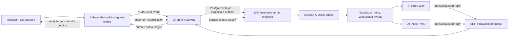

# Phase 3 — Instagram Browser Bridge Pilot Report

التاريخ: 2026-07-18  
الحالة: **تم تنفيذ البنية والكود والاختبارات المحلية، لكن القبول العملي على Instagram Test Account ما زال معلقًا لعدم وجود جلسة حساب تجريبي مسجلة على هذا الجهاز.**

## 1. حدود المرحلة

- Instagram Test Professional/Business Account فقط.
- استقبال وإرسال نصوص فقط.
- الإرسال الصادر يدوي من موظف/Admin فقط.
- AI يعمل `draft_only` ولا يملك أي مسار Auto Send.
- Messenger وMedia وBroadcast وView Once وVanish Mode خارج المرحلة.
- لم يتم تشغيل حساب M1 Store الحقيقي.
- لم يتم عمل Commit أو Push أو Deploy.

## 2. Architecture



Playwright موجود فقط داخل `services/m1-instagram-bridge`. لا يستورده ERP Backend أو Channel Gateway.

## 3. الملفات الجديدة الأساسية

- `services/m1-instagram-bridge/`: الخدمة المستقلة بالكامل.
- `services/m1-instagram-bridge/src/browser/InstagramPlaywrightDriver.js`: Persistent Context والتعامل مع Inbox.
- `services/m1-instagram-bridge/src/selectors/instagram.selectors.js`: Selector Registry مركزي وVersioned.
- `services/m1-instagram-bridge/src/domain/identity.js`: هوية المحادثة ومستوى الثقة.
- `services/m1-instagram-bridge/src/domain/messages.js`: Normalization وMessage Fingerprint وConfirmation Matcher.
- `services/m1-instagram-bridge/src/InstagramBridge.js`: Live Watch وRecovery Sync والإرسال والمصالحة.
- `services/m1-instagram-bridge/src/state/BridgeStateStore.js`: Checkpoint وDedupe وPending Reconciliation.
- `services/m1-instagram-bridge/src/diagnostics/DiagnosticsStore.js`: تشخيص محدود وRetention.
- `services/m1-instagram-bridge/src/safety/OperationSafety.js`: Rate Limit وDelay وCircuit Breaker.
- `services/m1-channel-gateway/src/adapters/InstagramBridgeAdapter.js`: Remote Adapter بين Gateway وBridge.
- `services/m1-channel-gateway/src/worker/ErpOutboundEventConsumer.js`: تحويل ERP Outbox إلى Outbound Jobs.
- `services/m1-channel-gateway/src/worker/ErpInboundOutboxWorker.js`: نشر الوارد والحالات إلى ERP بصورة قابلة لإعادة المحاولة.
- `server/routes/channelGatewayInternal.js`: دخول الرسالة والحالة إلى AI Inbox الحالي.
- `server/middleware/channelGatewayAuth.js`: HMAC وNonce Replay Protection.
- `services/m1-channel-gateway/migrations/003_instagram_bridge_pilot.sql`: Identity وReconciliation وRuntime State.
- `services/m1-channel-gateway/migrations/rollback/003_instagram_bridge_pilot.down.sql`: Rollback.

## 4. Feature Flags

كل القيم التالية مغلقة افتراضيًا:

```text
INSTAGRAM_BRIDGE_ENABLED=false
INSTAGRAM_BRIDGE_INBOUND_ENABLED=false
INSTAGRAM_BRIDGE_OUTBOUND_ENABLED=false
INSTAGRAM_BRIDGE_MEDIA_ENABLED=false
INSTAGRAM_BRIDGE_AI_AUTO_SEND_ENABLED=false
INSTAGRAM_BRIDGE_RECOVERY_SYNC_ENABLED=false
INSTAGRAM_AI_MODE=draft_only
INSTAGRAM_TEST_ACCOUNT_ONLY=true
CHANNEL_GATEWAY_ERP_INBOUND_PUBLISH_ENABLED=false
CHANNEL_GATEWAY_ERP_OUTBOUND_CONSUME_ENABLED=false
```

الخدمة ترفض الإقلاع بإعداد غير آمن إذا تغير الحساب عن `instagram-test-account` أو تم تفعيل Media أو AI Auto Send أو استخدام Chrome Profile شخصي.

## 5. Session Storage

- Persistent Playwright Profile مستقل: `/data/browser-profiles/instagram-test-account`.
- لا يوجد Username أو Password أو 2FA داخل الكود أو `.env`.
- Login و2FA يدويان من `npm run login` في وضع مرئي.
- Docker Volume منفصل وغير مرفوع إلى Git.
- `.gitignore` يمنع Profiles وSessions وDiagnostics المحلية.
- انتهاء الجلسة ينتج `login_required`/`session_expired` ويوقف العمليات؛ لا يوجد تجاوز Challenge.

## 6. Selector Registry

النسخة: `instagram-web-2026.07-pilot.1`.

كل عنصر له Primary وFallback وValidation وVersion. الأولوية لـARIA Roles وAccessible Names وStable URLs، مع Fallback CSS مركزي. لا توجد Selectors موزعة عشوائيًا في الخدمة.

## 7. Conversation Identity

الهوية تتكون من Thread ID/URL + Username + Header Identity + Channel Account. ويتم تخزين:

```text
channel_connection_id
external_conversation_id
external_customer_id
external_username
external_display_name
conversation_fingerprint
identity_confidence: high|medium|low
last_verified_at
```

Low confidence يمنع الإرسال ويحول المهمة إلى `needs_manual_review`.

## 8. Inbound Flow

1. Live Watch أو Recovery Sync يقرأ النصوص فقط.
2. يبني External ID أو Fingerprint ثابتًا.
3. Local checkpoint يمنع تكرار نفس DOM observation.
4. Gateway يخزن الحدث في PostgreSQL ويطبق Dedupe للمرة الثانية.
5. Gateway Outbox ينشر الحدث إلى ERP عبر HMAC.
6. ERP يستخدم `appendInboundAiSupportMessage` الحالي.
7. يتم إنشاء AI Draft بواسطة `generateAiInboxReply(... persist: true)` فقط.
8. يتم بث `ai_inbox:message` و`ai_inbox:refresh` الحاليين إلى Web وPWA.

## 9. Outbound Flow

1. مسار AI Inbox يكتشف Conversation ID بالشكل `instagram:<connection>:<thread>`.
2. الرد اليدوي يحفظ كـ`queued` داخل AI Inbox وERP Outbox في Transaction واحدة.
3. `ErpOutboundEventConsumer` يرفض أي حدث غير يدوي أو AI ويضعه Dead Letter.
4. Outbound Job دائم وIdempotent يُسند إلى Instagram Adapter.
5. Bridge يعيد فتح المحادثة ويتحقق من Header وUsername وFingerprint.
6. بعد Send يجب ظهور Outgoing Bubble بنفس النص.
7. الحالة تصبح `confirmed` أو `sent_unconfirmed`.
8. Status Outbox يعيد الحالة إلى AI Inbox مع نفس WebSocket events.

## 10. Uncertain Send Reconciliation

إذا حدث Timeout بعد Send لا يحدث Retry مباشر. تحفظ العملية Pending، ثم يعاد فتح المحادثة والبحث في الرسائل الصادرة الحديثة بالنص والوقت. النتيجة:

- الرسالة موجودة: `confirmed`.
- لا يوجد تأكيد كافٍ: `needs_manual_review`.
- لا يوجد إرسال تلقائي ثانٍ قبل المصالحة.

## 11. Live Watch وRecovery Sync

- Live Watch يراقب تغير ترتيب/Preview المحادثات ويفتح عددًا محدودًا فقط.
- Recovery Sync دوري وقابل للإعداد ويقرأ عددًا محدودًا من المحادثات.
- المصدران يستخدمان نفس External ID/Fingerprint وCheckpoint؛ نفس الرسالة تحفظ مرة واحدة.
- Restart يعيد State من ملف Atomic بPermissions `0600`.

## 12. Health وRecovery

الحالات المدعومة:

```text
healthy, degraded, login_required, session_expired,
selector_failure, inbox_unavailable, browser_crashed, paused
```

Recovery تدريجي: Reload ثم Reopen Tab ثم Restart Context/Process. Login Challenge وSelector Failure المتكرر يوقفان الخدمة. Gateway يوفر Health وPause/Resume وForce Sync وRestart endpoints محمية بـHMAC.

## 13. Diagnostics وSecurity

- Screenshot عند الفشل مع Mask لمنطقة `main` لتقليل كشف المحادثة.
- Current URL وSelector Version وError Code وOperation وCorrelation ID فقط.
- لا Cookies أو Tokens أو Password أو Local Storage في Logs.
- Structured Log Redaction يخفي بيانات العملاء والنصوص.
- Retention افتراضي 72 ساعة وحد أقصى 100 ملف.
- HMAC يغطي Timestamp وNonce وMethod وPath وExact Body.
- Nonce Replay Protection في Gateway وERP، وذاكرة محدودة داخل Bridge.
- Rate Limit لفتح المحادثات، Natural Delay، Backoff، Pause، وSend Circuit Breaker.

## 14. Docker

- Compose profile اختياري: `instagram-pilot`.
- `restart: "no"` والخدمة نفسها Disabled افتراضيًا.
- لا Public Port.
- Internal network.
- Profile/Diagnostics/State volumes مستقلة.
- Read-only filesystem و`tmpfs` وNon-root user.
- Memory/CPU limits وLog Rotation وHealthcheck.
- لم يمكن تنفيذ `docker compose config` أو بناء Image لأن Docker غير مثبت/متاح في البيئة الحالية.

## 15. نتائج الاختبارات

- Instagram Bridge unit tests: **17/17 passed**.
- Channel Gateway tests: **16 passed, 0 failed, 9 PostgreSQL tests skipped**.
- Phase 2 + Phase 3 Web/PWA static integration tests: **11/11 passed**.
- AI Inbox flow script: **passed** (كل السيناريوهات A–I).
- Production Vite build: **passed**.
- ESLint للملفات الجديدة والمعدلة: **0 errors, 0 warnings**.
- Syntax checks و`git diff --check`: **passed**.
- Full repository suite: **332 total / 316 passed / 7 failed / 9 skipped**.

الإخفاقات السبعة هي نفس الإخفاقات القديمة غير المرتبطة بالمرحلة: POS service-worker (2)، product pricing (2)، purchase quantity (1)، storefront compact footer (1)، Mirror Original hero (1).

اختبار `test:ai-channel-parity` المنفصل توقف بسبب Fixture المنتجات الحالي الذي لا يحتوي اللون المتوقع `Black & Gray`؛ لم تعدل هذه المرحلة بيانات المنتجات أو منطق المطابقة.

## 16. Performance

Benchmark محلي لـIdentity + Normalization + Fingerprint، عدد 20,000 عملية:

```text
p50 = 0.0260 ms
p95 = 0.0738 ms
p99 = 0.5465 ms
max = 46.5138 ms
```

هذا القياس لا يشمل Instagram DOM/Network latency لأنه لم يتم تشغيل حساب تجريبي فعليًا.

## 17. ما لم يمكن اختباره فعليًا

- Login/2FA واستعادة Session لحساب Instagram Test Account.
- User A وUser B والسيناريوهات العملية السبعة على Instagram الحقيقي.
- تغيرات DOM وSelectors الفعلية في النسخة الحالية من Instagram.
- إرسال رسالة حقيقية وظهور Bubble حقيقية.
- Web/PWA live end-to-end من Instagram الحقيقي.
- Migration 003 وOutbox end-to-end على PostgreSQL محلي: الخدمة تعمل محليًا لكن بيانات الاتصال غير متاحة، لذلك بقيت 9 integration tests معلقة.
- Docker image/Compose validation: Docker غير متاح.

لهذا لا يجوز اعتبار Phase 3 **Operationally Accepted** قبل تنفيذ هذه الاختبارات على حساب تجريبي فقط.

## 18. المخاطر

- Instagram Web DOM غير Contract رسمي وقد يتغير دون إشعار.
- Browser Automation قد يتأثر بقيود المنصة أو Login Challenge.
- Direction detection وAccessible labels يجب معايرتهما على الحساب التجريبي قبل التفعيل.
- Screenshots—even masked—تظل بيانات حساسة ويجب تشفير Volume وتقييد الوصول.
- Browser Bridge Pilot حل مرحلي؛ Official API يظل المسار الأفضل عندما يتوفر.

## 19. Rollback

1. اترك جميع Flags بالقيمة `false`؛ هذا يعيد النظام للمسارات السابقة فورًا.
2. أوقف Compose profile `instagram-pilot`.
3. شغّل `migrations/rollback/003_instagram_bridge_pilot.down.sql` فقط إذا تقرر إزالة Schema الإضافي، بعد مراجعة بيانات `sent_unconfirmed`.
4. أزل Internal route وGateway workers وAdapter إن كان المطلوب إزالة الكود.
5. لا تحذف Profile Volume إلا بعد تأكيد أن جلسة الحساب التجريبي لم تعد مطلوبة.
6. WhatsApp وMeta Official APIs وWebSocket event names لا تحتاج أي Rollback لأنها لم تتغير.

## 20. قرار التوقف

تم التوقف عند Phase 3. لم يبدأ Messenger Bridge أو Media. لم يتم Commit أو Push أو Deploy، ولم تُفعّل الخدمة أو أي Flag في بيئة التشغيل.
